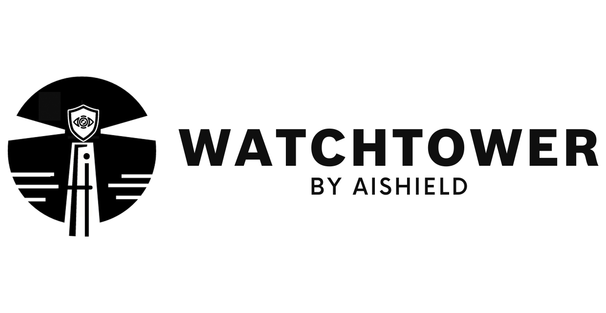
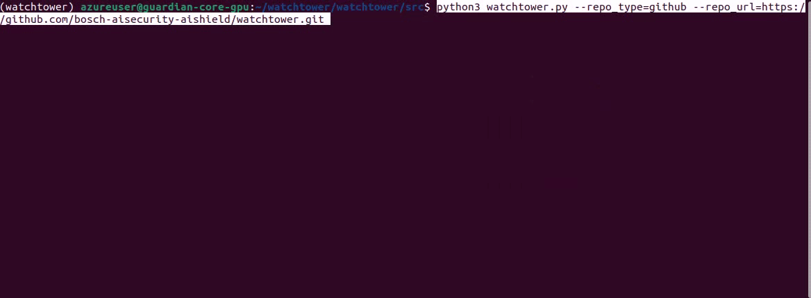

# AIShield.Watchtower 🔍: Fortifying AI/ML Model and Notebook Security

In today's rapidly advancing landscape of machine learning and artificial intelligence (AI), ensuring the security of AI
models has become an imperative. These models serve as the driving force behind decision-making in a myriad of
applications. As such, safeguarding their integrity and protection against potential attacks remains a top priority.
Unfortunately, the critical components of this AI ecosystem, namely Jupyter notebooks and models, are often overlooked
in routine security assessments, leaving them vulnerable and appealing targets for potential attackers. Initial tests
with open-source tools painted a grim picture, underscoring severe limitations and an urgent need for a bespoke solution.
As AI/ML models continue to reshape industries and drive innovation, the significance of model security is paramount.
However, amidst the excitement of AI's potential, the security of Jupyter notebooks and AI models has been consistently
relegated to the shadows.

A compelling illustration of this security blind spot revolves around the widespread usage of Jupyter notebooks.
Within these digital pages lie the blueprints, codes, and algorithms that breathe life into many of today's AI-driven
products and services. However, like any other codebase, Jupyter notebooks are not immune to vulnerabilities that could
inadvertently find their way into the final product. These vulnerabilities, if left unaddressed, can become gateways
for cyber-attacks, risking not only the integrity of AI-driven products but also the security of user data.

**AIShield Watchtower** is designed to automate model and notebook discoveries and conduct comprehensive vulnerability scan.
Its capabilities go beyond merely identifying all the models and notebooks within your repository. It assesses risks, such as hard-coded secrets, PIIs, outdated/unsafe libraries, model serialization attacks, custom unsafe operations etc.

AIShield Watchtower stands out with its capability to categorize scans into four distinct risk levels: "low," "medium,"
"high," and "critical." This classification equips organizations with the ability to tailor their security efforts to
the level of risk detected. Its adaptive approach and meticulous risk categorization significantly bolster security
efforts, fortifying them effectively. Watchtower's alignment with industry standards such as OWASP, MITRE, CWE, NIST AI RMF MAP functions
further enhances its market standing by providing advanced security solutions.

## Table of Contents

- [Usage](#usage)
  - [Prerequisite](#prerequisite)
  - [Inspect Jupyter Notebooks and Models Using](#prerequisite)
    - [CLI](#cli)
    - [UI](#ui)
    - [UI-Docker](#ui-docker)
- [Reports](#reports)
- [Features](#features)
- [Benefits](#benefits)
- [Limitation](#limitation)
- [Contribution](#contribution)
- [License](#license)

## Usage

AIShield Watchtower can be used to inspect vulnerabilities in Jupyter notebooks, requirements.txt and AI/ML Models (Ref:[Features](#features)).

For using AIShield Watchtower, clone Watchtower repo. Install prerequisites and scan your notebooks and AI/ML models. Some starting sample test files are available within the Watchtower repo.

---

### Prerequisites

- For  running Watchtower in CLI or UI version, python3 and pip should be installed in the host system.
- For running UI-Docker version, docker and docker-compose should be installed in the host system.
> ⚠️ **Warning:** 
> As a security precaution when using the webapp or the Docker version, it is recommended to scan unknown/untrusted artifacts in a networkless Docker container on the host machine.

Cloning Watchtower repo

```git
git clone https://github.com/bosch-aisecurity-aishield/watchtower.git
cd watchtower
```
### Install Watchtower related dependency libraries using following commands:

#### Run this command to install dependency in Linux(Ubuntu) system:
```bash
./install.sh
```

#### Run this command to install dependency in windows system:
```powershell
./install.bat
```

---

### Inspect Jupyter Notebooks and ML/DL Models 

Change directory to src.

```bash

cd src

```

Inspection of Jupyter Notebooks and ML/DL models can be done by any of the below methods:

#### CLI

To View the available options in CLI mode

```python
python watchtower.py -h 
```

##### To scan the model files (.h5, .pb and .keras) 
To scan the model files in .h5, .pb and .keras format, use the **--scan_tf_model** argument together with any of the Repo. This is currently supported for Linux OS Systems.
For Example for github: 

```python
python watchtower.py --repo_type=<Repo-Type> --repo_url=<Repo-url> --branch_name=<Enter Branch Name> --scan_tf_model
```

##### To inspect artifacts present in Public Github Repo

```python
python watchtower.py --repo_type=github --repo_url=<Enter Repo Url> --branch_name=<Enter Branch Name> --depth=<Enter a number>
```
NOTE: branch_name and depth parameters are optional. Default value of branch_name is main and default depth value is 1
##### To inspect artifacts present in Huggingface Repo

```python
python watchtower.py --repo_type=huggingface --repo_url=<Enter Hugging Face Url>
```

##### To scan the artifacts present in AWS S3 bucket

```python
python watchtower.py --repo_type=s3 --bucket_name="<Enter Bucket name>" --region="<Enter region of s3 bucket>" --aws_access_key_id="<Enter aws access key>" --aws_secret_access_key="<Enter aws secret key>"
```

##### To scan the artifacts present in local system

```python
#Select Repo_type = file for scanning individual file
python watchtower.py --repo_type=file --path=<Enter path of File>
#Select Repo_type = file for scanning individual file
python watchtower.py --repo_type=folder --path=<Enter path of Folder>
```



---
## UI
For using Watchtower UI, execute the following command:
```python
python watchtower_webapp.py
```
---


## UI-Docker

For using Watchtower UI with Docker, build docker image for watchtower and run watchtower image
```python
cd watchtower
docker-compose build
docker-compose up
```

open browser and paste: http://localhost:5015/watchtower-aishield

On successful completion of scan, Watchtower vulnerability reports will be available in reports folder in Watchtower root folder.

For stopping and removing Watchtower image execute following

```python
docker-compose down
```
---

## Reports

On successful completion of the Watchtower scan, three reports will be generated in the following path :

- For CLI Mode - all three reports will be available inside the Watchtower src folder. Users may refer last line of the summary report in the console for the complete path of the reports location

- For UI Mode - all three will be reports will be available inside the Watchtower src folder. Users may refer to the success message on the UI to get the path of the reports location

- For UI-Docker Mode - all three reports will be available inside the Watchtower reports folder. Users may refer to the success message on the UI to get the path of the reports location

01. Summary Report - In summary report will provide information on number of model files and notebook files detected, Number of vulnerabilities detected and Count of those vulnerabilities mapped to Critical, High, Medium and low. Sample snippet of Summary Report:

```json
{
       "Repository Type": "github",
       "Repository URL": "https://github.com/bosch-aisecurity-aishield/watchtower.git",
       "Total Number of Model Found": 17,
       "Total Number of Notebooks & Requirement files Found": 6,
       "Total Number of Model Scanned": 17,
       "Total Number of Notebooks & Requirement files Scanned": 6,
       "Total Notebook & Requirement files Vulnerabilities Found": {
              "Critical": 0,
              "High": 40,
              "Medium": 17,
              "Low": 1
       },
       "Total Model Vulnerabilities Found": {
              "Critical": 0,
              "High": 4,
              "Medium": 2,
              "Low": 8
       }
}
```

02. Severity Mapping Report - In this report, details of High, Medium and Low mapping to Model or Notebooks is reported. Sample snippet of Severity Mapping Report:

```json
  {
         "type": "Hex High Entropy String",
         "filename": "repo_dir_1696827949/sample_test_files/sample_notebook_files/classification_notebook.py",
         "hashed_secret": "8d1e60a0b91ca2071dc4027b6f227990fb599d27",
         "is_verified": false,
         "line_number": 47,
         "vulnerability_severity": "High"
      },
      {
         "type": "Secret Keyword",
         "filename": "repo_dir_1696827949/sample_test_files/sample_notebook_files/classification_notebook.py",
         "hashed_secret": "8d1e60a0b91ca2071dc4027b6f227990fb599d27",
         "is_verified": false,
         "line_number": 47,
         "vulnerability_severity": "High"
   }
```

03. Detailed Report - In this report, Watchtower users will be able to find all logs generated during the vulnerability scan.

## Features

- **Model and Notebook Detection**: Automatically recognizes AI/ML models and Notebooks within a provided repository. 
- **Scanning**:Executes thorough scans of the models and notebooks to detect potential safety and security concerns.

Supported Model Formats: 

| Framework         | File Format      | Deserialization       | Backdoor Attacks       | Runtime Threats       |
|-------------------|------------------|------------------------|-------------------------|------------------------|
| [Tensorflow](https://www.tensorflow.org/tutorials/keras/save_and_load#save_the_entire_model) | .pb       | ✅               | ✅                        |                        |
| [Tensorflow](https://www.tensorflow.org/tutorials/keras/save_and_load#save_the_entire_model) | .h5       | ✅               |  ✅                       |                        |
| [Tensorflow-savedmodel](https://www.tensorflow.org/) | .ckpt    | ✅               |                         |                        |
| [Keras](https://keras.io/api/models/model_saving_apis/model_saving_and_loading/#save_model-function)         | .keras    | ✅               |  ✅                       |                        |
| [Keras](https://keras.io/api/models/model_saving_apis/model_saving_and_loading/#save_model-function)         | .h5       | ✅               |  ✅                       |                        |
| [PyTorch](https://pytorch.org/docs/stable/generated/torch.save.html#torch.save)       | .pt       | ✅               |                         |                        |
| [PyTorch](https://pytorch.org/docs/stable/generated/torch.save.html#torch.save)       | .pth      | ✅               |                         |                        |
| [PyTorch](https://pytorch.org/docs/stable/generated/torch.save.html#torch.save)       | .bin      | ✅               |                         |                        |
| <span style="color:gray">[ONNX*](https://onnx.ai/)</span>            | <span style="color:gray">.onnx*</span>     | <span style="color:gray"></span>           | <span style="color:gray">✅</span>           | <span style="color:gray"></span>         |
| <span style="color:gray">[GGUF*](https://github.com/ggerganov/ggml)</span>            | <span style="color:gray">.gguf*</span>     | <span style="color:gray"></span>           | <span style="color:gray"></span>           | <span style="color:gray">✅</span>         |
| [Scikit-Learn](https://scikit-learn.org/stable/modules/model_persistence.html) | .pkl      | ✅               |                         |                        |
| Misc | .zip      | ✅               |                         |                        |
*For more details on these file formats, please write to [AIShield.Contact@in.bosch.com](mailto:AIShield.Contact@in.bosch.com).

- **Report Generation**: Produces comprehensive reports that classify the scanned files containing "low," "medium,", "high" and "critical" risk.
- **Supported Repositories** : AIShield Watchtower supports integration with GitHub, Huggingface and AWS S3 buckets, allowing for automated scanning of repositories and AWS S3 buckets to identify potential risks.


---

## Benefits

1. **Real-time scanning** is an essential component for the swift identification and mitigation of emerging threats. This
   feature ensures that any changes or additions to AI/ML models and notebooks are promptly analyzed. It enables
   immediate action against potential vulnerabilities, thereby preserving the integrity of AI/ML applications.
2. **Versatile Framework Support** allows Watchtower to cater to a wide array of AI/ML projects by ensuring
   compatibility with diverse model frameworks. This versatility enables organizations to leverage Watchtower
   regardless of the frameworks they utilize, making it a universally applicable security tool.
3. **Dynamic Risk Identification** plays a pivotal role in adapting to evolving threats and vulnerabilities within
   the ever-changing landscape of AI/ML. This adaptability is vital as new threat types continually emerge, demanding
   a security tool that can evolve and adapt in tandem.
4. **Comprehensive Assessment** offered by Watchtower covers a wide spectrum of vulnerability assessments, identifying
   and analyzing a broad range of risks. It meticulously examines all aspects of potential threats, ensuring that
   individuals and organizations possess comprehensive knowledge of their security landscape.
5. **Industry Standards Compliance** is ensured through alignment with renowned security standards such as OWASP,
   MITRE, and CWE. This compliance guarantees that Watchtower adheres to globally recognized security practices,
   establishing a baseline of security and fostering trust among stakeholders.
6. **Efficiency and Scalability** are achieved through automated assessments, significantly accelerating security
   workflows. This efficiency is critical for organizations expanding their AI/ML initiatives, ensuring that security
   does not hinder development processes during scaling.
7. **Seamless Integration** is a valuable feature that allows Watchtower to integrate effortlessly with popular
   AI/ML platforms and repositories. It simplifies the incorporation of Watchtower into existing development
   ecosystems, streamlining security implementation and ensuring consistency across platforms.
8. **Informed Decision-Making** is facilitated by detailed vulnerability reports generated by Watchtower.
   These reports empower organizations to prioritize actions and allocate resources effectively, enabling prompt
   addressing of critical vulnerabilities and optimal resource utilization.
9. **Competitive Advantage** is gained by leveraging advanced security tools like Watchtower in a market where
   security is of paramount concern. This advantage not only appeals to clients and end-users but also instills
   confidence among stakeholders. It underscores the organization's commitment to securing its AI/ML assets against a
   wide range of risks, from model tampering to unauthorized data access. This comprehensive assessment ensures a
   thorough examination of all possible vulnerabilities, leaving no stone unturned in safeguarding AI/ML assets.

---

## Limitation

1. Limited support for scanning of .pb file from s3 buckets.
2. Presidio analyser has a max length limit of upto 1000000 (1GB). Any data greater than 1GB will not be captured in reports.  
3. Possible mismatch in severity levels from Whispers library and Watchtower severity levels.

### Upcoming Features

1. Reduce false positives by using these customized versions that detect vulnerabilities more accurately.
2. Refine PII severity assessment with contextual rules for varied levels.
3. Enhance model vulnerability detection by adding checks for the embedding layer's potential issues.
4. Integration with Github actions

## Known Issues

1. Repositories cloned from GitHub and Hugging Face during watchtower analysis are not automatically removed
   post-analysis. It is advisable to manually delete these folders found within the 'src' directory.

---

## Contribution

Contributions are always welcome! See the [Contribution Guidelines](CONTRIBUTE.md) for more details.

1. [Parmar Manojkumar Somabhai](https://www.linkedin.com/in/manojkumarparmar/)
2. [Amit Phadke](https://www.linkedin.com/in/avphadke/)
3. [Deepak Kumar Byrappa](https://www.linkedin.com/in/deepakbyrappa/)
4. [Pankaj Kanta Maurya](https://www.linkedin.com/in/pankaj-maurya-profile/)
5. [Ankita Kumari Patro](https://www.linkedin.com/in/ankita-kumari-patro-549112158/)
6. [Yuvaraj Govindarajulu](https://www.linkedin.com/in/yuvaraj-govindarajulu/)
7. [Sumitra Biswal](https://www.linkedin.com/in/sumitra-biswal-422472191/)
8. [Amlan Jyoti](https://www.linkedin.com/in/amlan-jyoti/)
9. [Mallikarjun Udanashiv](https://www.linkedin.com/in/mallikarjun-udanashiv-786a91100/)
10. [Manpreet Singh](https://www.linkedin.com/in/manpreet-singh-36901a19/)
11. [Shankar Ajmeera](https://www.linkedin.com/in/shankar-ajmeera-00b22522a/)
12. [Aravindh J](https://www.linkedin.com/in/aravindhj6/)

---

## License

This project is licensed under the Apache License. See [LICENSE](LICENSE.md) for details.

## Acknowledgments

First and foremost, we want to extend our deepest gratitude to the vibrant open-source community. The foundation of AI Watchtower by AIShield is built upon the collective wisdom, tools, and insights shared by countless contributors. It's a privilege to stand on the shoulders of these giants:
- [Yelp's detect-secrets](https://github.com/Yelp/detect-secrets): Used for scanning configurations to prevent accidental commitment of sensitive data.
- [Safety](https://github.com/pyupio/safety): Used for scanning python dependencies for known security vulnerabilities and suggests the proper remediation for vulnerabilities detected.
- [Whispers](https://github.com/Skyscanner/whispers) : Identify hardcoded secrets in static structured text
- [Whispers: Advanced secrets detection](https://medium.com/@SkyscannerEng/whispers-advanced-secrets-detection-15dd64a9dfb7)
- [Presidio Analyzer](https://microsoft.github.io/presidio/analyzer/): The Presidio analyzer is a Python based service for detecting PII entities in text
- [PII Confidentiality Impact Levels](https://www.dvidshub.net/image/6145774/pii-confidentiality-impact-levels)
- [Top open source licenses and legal risk for developers](https://www.synopsys.com/blogs/software-security/top-open-source-licenses.html)
- [Secure API keys](https://blog.hubspot.com/website/api-keys)
- [OWASP Top 10: Vulnerability and Outdated Components](https://owasp.org/Top10/A06_2021-Vulnerable_and_Outdated_Components/)
- [Chris Anley - Practical Attacks on Machine Learning Systems](https://research.nccgroup.com/2022/07/06/whitepaper-practical-attacks-on-machine-learning-systems/)
- [Abhishek Kumar - Insecure Deserialization with Python Pickle module](https://medium.com/@abhishek.dev.kumar.94/sour-pickle-insecure-deserialization-with-python-pickle-module-efa812c0d565)
- [Shibin B Shaji - Using Python’s pickling to explain Insecure Deserialization](https://medium.com/@shibinbshaji007/using-pythons-pickling-to-explain-insecure-deserialization-5837d2328466)
- TensorFlow Model Comparison: Insights from Saturn Cloud [[1](https://saturncloud.io/blog/how-to-convert-a-tensorflow-frozen-graph-to-savedmodel/), [2](https://saturncloud.io/blog/list-of-tensor-names-in-graph-in-tensorflow/), [3](https://saturncloud.io/blog/how-to-examine-the-feature-weights-of-a-tensorflow-linearclassifier/) ]
- [TensorFlow Remote Code Execution with Malicious Model](https://splint.gitbook.io/cyberblog/security-research/tensorflow-remote-code-execution-with-malicious-model)
- [TensorFlow layers embedding causes memory leak](https://github.com/tensorflow/tensorflow/issues/30952)
- [Adding embeddings for unknown words in Tensorflow](https://saturncloud.io/blog/how-to-add-new-embeddings-for-unknown-words-in-tensorflow/)
- [Data Leakage in Machine Learning](https://towardsdatascience.com/data-leakage-in-machine-learning-how-it-can-be-detected-and-minimize-the-risk-8ef4e3a97562)
- [Race Conditions and Secure File Operations](https://developer.apple.com/library/archive/documentation/Security/Conceptual/SecureCodingGuide/Articles/RaceConditions.html)
- [Nuthdanai Wangpratham - Feature Scaling Matters for Accurate Predictions](https://medium.datadriveninvestor.com/scaling-for-success-why-feature-scaling-matters-for-accurate-predictions-6e4f29fe58b7)
- [Predicting how and when hidden neurons skew measured synaptic interactions](https://journals.plos.org/ploscompbiol/article?id=10.1371/journal.pcbi.1006490)
- [Deserialization bug in TensorFlow machine learning framework allowed arbitrary code execution](https://portswigger.net/daily-swig/deserialization-bug-in-tensorflow-machine-learning-framework-allowed-arbitrary-code-execution)
- [Tom Bonner - A Deep Dive into Security Risks in TensorFlow and Keras](https://hiddenlayer.com/research/models-are-code/)
- [Security in MLOps Pipeline](https://irmcon.com/blog/security-in-mlops-pipeline/)
- [A traditional attack vector applied to AI/ML Models](https://5stars217.github.io/2023-03-30-on-malicious-models/)
- [Pickle Scanner Reference github url ](https://github.com/mmaitre314/picklescan/tree/main)
- [Pypi Reference url for Pickle Scanner library](https://pypi.org/project/picklescan/)

... and to many others who have contributed their knowledge on open-source licenses, API key security, MLOps pipeline security, and more.

In creating AI Watchtower, it's our humble attempt to give back to this incredible community. We're inspired by the spirit of collaboration and are thrilled to contribute our grain of sand to the vast desert of open-source knowledge. Together, let's continue to make the AI landscape safer and more robust for all!

